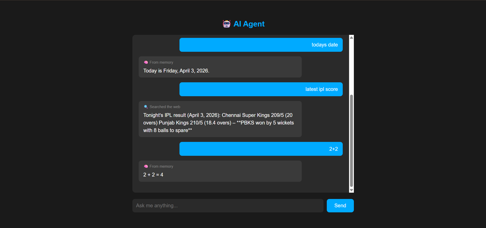

# AI Agent 



# AI Agent access

https://ai-agent-3job.onrender.com


Built this to understand how AI agents actually work under the hood.
Turns out you can get a working AI agent running in under 100 lines of Python.

The agent decides on its own when to search the web vs answer from memory.
That's the same concept behind Perplexity and ChatGPT's browsing feature.

## How it works

User asks a question
        ↓
AI thinks — do I need to search?
        ↓
YES → searches web → reads results → answers with sources
NO  → answers instantly from memory

## Features

- Answers simple questions instantly from memory
- Searches the web automatically for current/recent info
- Remembers full conversation context
- Clean web interface built with Flask
- Powered by Groq (fast, free inference)

## Project Structure

chatbot.py        → v1 terminal chatbot
app.py            → v2 flask web interface
templates/
└── index.html    → chat UI

## Stack

- Groq API — moonshotai/kimi-k2-instruct
- Tavily — real time web search built for AI
- Flask — lightweight Python web framework
- Python 3.12

## The hardest part

Describing the search tool to the AI using JSON so it knows
when to call it. One wrong key and it breaks silently.
Took a while to debug — but that's where the real learning happened.

### Terminal version
```bash
python chatbot.py
```

### Web version
```bash
python app.py
```
Then open `http://127.0.0.1:8080`

## What I learned

- How LLM tool use works under the hood
- Managing conversation history manually
- Integrating multiple APIs in one project
- Secure API key handling with .env
- Wrapping AI logic in a Flask web app

## Built by

Ayush Mishra — 2nd year CS student building toward AI engineering  
github.com/mishra-codes | linkedin.com/in/dev-ayushmishra
